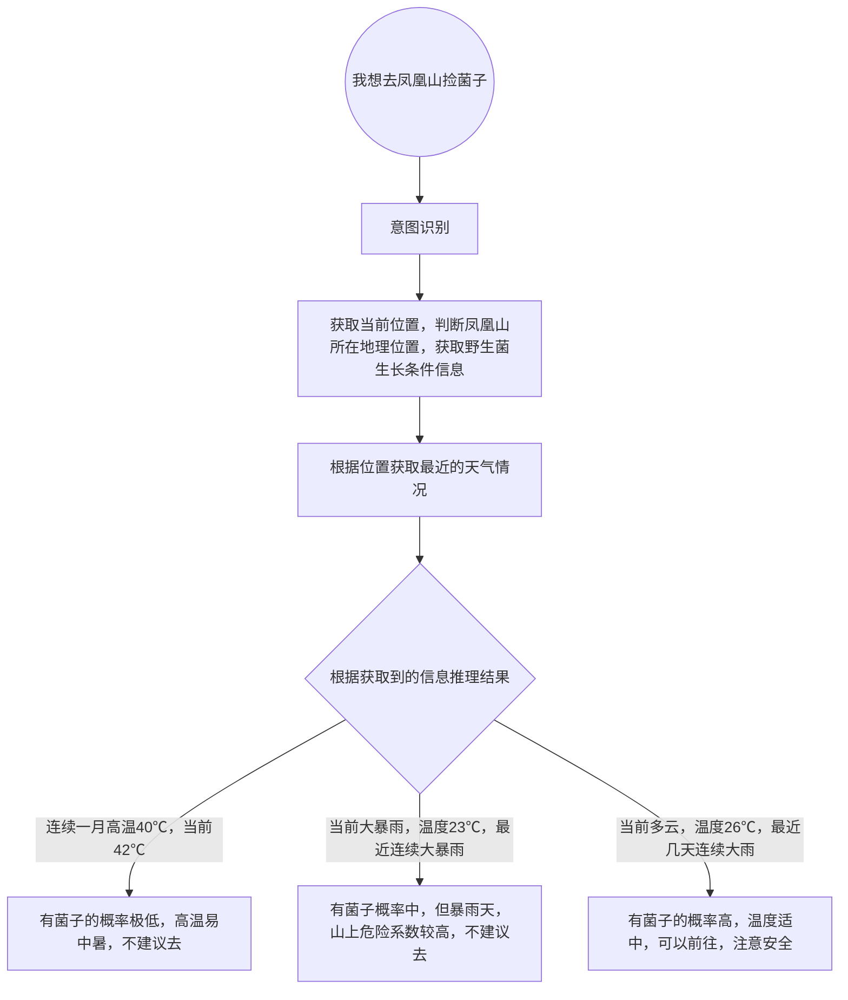
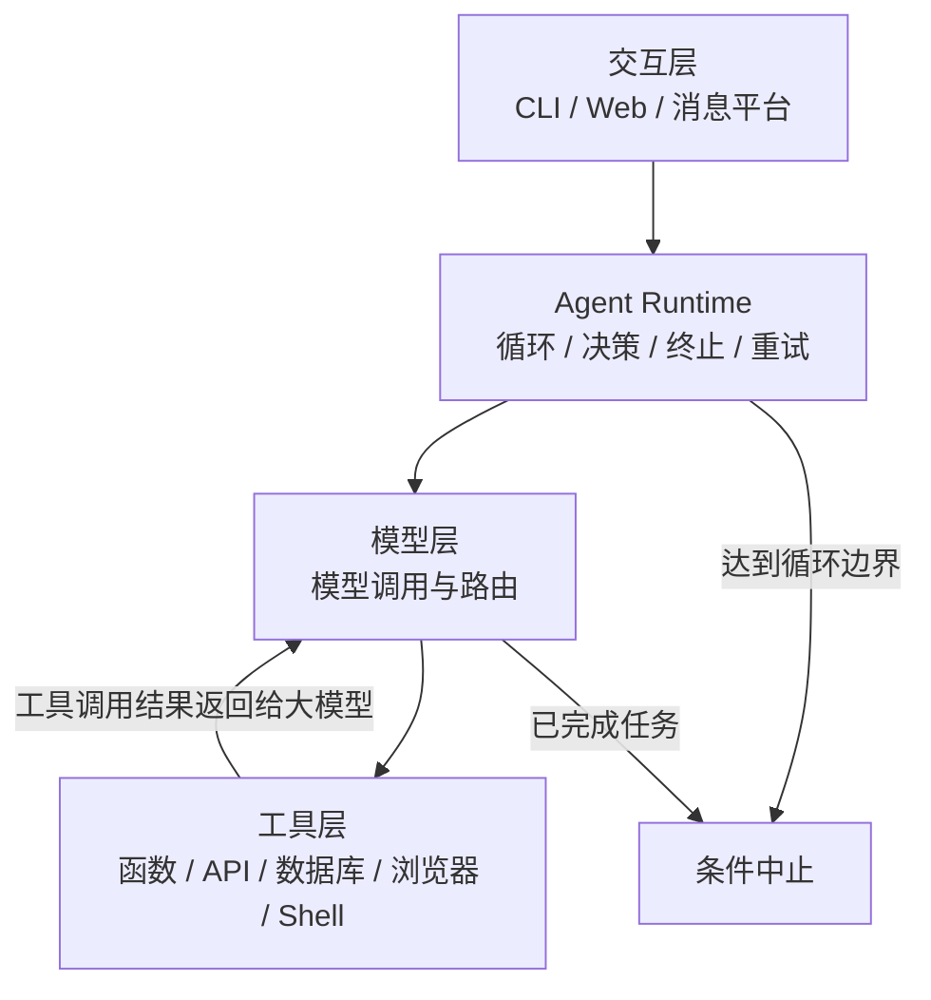

# Agent 是什么？

> 学习记录：2026-08-07


Agent又被称之为智能体，通俗的说就是一个可以理解你的需求并帮你干活的AI。
通常Agent分为2个大类：

| 类型 |  工作方式| 特点 |
|---|---|---|
| 工作流型 | 程序预先规定工作流程，大模型只在必要的步骤参与推理 | 稳定、容易测试、执行路径有限 |
| 自主循环型 | 模型根据当前状态决定下一步要干啥 | 灵活，可以动态规划和调用工具 |

工作流型，像目前市面上的扣子和 ComfyUI 这一类的都属于工作流型Agent。
自主循环型，就是根据工作的状态，自己决定下一步要干什么。


本篇笔记以自主循环型Agent为主。 
> 一个基本的 Agent 包含大语言模型、Agent Loop，以及 tools。
> 
> 我们以一个更抽象的方式来理解，将 Agent 比作一个人，大语言模型就是大脑，负责思考和决策，Agent Loop 则是心脏，推动血液循环，输送养分，维持系统的基本运转
> 
> Tools 则是功能型器官以及肢体，有了它们，Agent 才能真正的做事。


## 大语言模型（LLM）

简称大模型，大模型可以理解为Agent的大脑，用于理解自然语言， 提取信息，推理判断，识别意图，生成本轮结果等等

## Agent

Agent是一个完整的执行系统， 大模型做决策层，Agent做执行层。

以人类为例，大脑发出一个目标指令： 去拿个苹果吃
整体步骤被简单拆解为： 

- 大脑思考： 目前你的身处环境在客厅沙发， 首先你要去到厨房
- 脚接收行走指令，前往厨房
- 来到厨房后大脑给手发指令： 打开冰箱门
- 手执行指令
- 随后眼睛获取冰箱内的环境布局，大脑识别到环境后，找到苹果的位置，给手发指令，到特定的位置拿一个苹果
- 手执行大脑发送的指令
- 拿到苹果后，大脑根据往日经验， 又认为应该削皮吃， 给脚发送指令，走到削皮刀的位置
- 脚执行指令后，来到了削皮刀的位置，又给手发指令拿取削皮刀削皮。
- 这些执行完成后，大脑又给脚发指令， 去到客厅沙发
- 给嘴和手发指令，开始吃苹果。

对于Agent而言，也类似，比如用户给了一个目标指令： 我想去凤凰山捡菌子。
Agent的步骤： 




可以先用下面这个关系理解：


模型：负责理解、推理和生成内容
工具：让程序可以读取信息或执行操作，比如获取天气，位置等信息
循环：推动 Agent 一步一步往下执行，比如获取到了位置后，还不能算完成任务，进入下一轮，将获取到的位置交给大模型，大模型根据当前任务进度或者上下文来判断下一步应该获取天气情况。 
Agent：把这些部分组织起来完成目标


如果只有模型，它只能根据已有上下文生成内容。加入工具后，它可以搜索网页、查询数据库、读取文件或执行代码。加入循环后，它可以根据工具返回的结果继续决定下一步。

所以，“Agent”并不意味着它真的有意识，也不意味着它一定比普通模型聪明。它主要描述一种工作方式：模型不只回答一次，而是参与一个持续执行的过程。

## 模型对于Agent的影响
不同模型对于Agent的影响要根据执行的任务复杂度来判断
- 如果是简单的任务，大多数的大模型都可以完美的理解和执行， 所以差异不大。
  - 就像你让一个小学生算1+1和让大学生算1+1一样，得出的结果并没有区别
- 如果是复杂的任务，当然要是越强大的模型越好， 比如要写一个企业OA系统， 让ChatGPT1.0 来写， 那可能就是一坨。


## 几个常见 Agent 的区别

下面按当前产品的主要定位来理解。产品会持续变化，不能把它们看成完全固定的类别。

| 产品 | 主要定位 | 主要特点 |
| --- | --- | --- |
| [Codex](https://learn.chatgpt.com/docs/codex/cli) | 软件工程 Agent | 面向代码库工作，可以检查文件、修改代码、运行命令和测试，也支持子 Agent、本地任务和云端任务 |
| [Claude Code](https://code.claude.com/docs/en/overview) | 软件工程 Agent | 重点是理解整个代码库、跨文件修改、执行开发命令，并通过 Skills、Hooks、MCP、Subagent 和 Agent Team 扩展工作流 |
| [OpenCode](https://opencode.ai/docs/zh-cn/agents/) | 开源编码 Agent | 不绑定单一模型供应商，提供 Build、Plan 等主 Agent，以及 Explore、Scout、General 等子 Agent，权限配置比较细 |
| [Hermes Agent](https://github.com/NousResearch/hermes-agent) | 通用个人 Agent | 强调长期记忆、根据经验创建和改进 Skills、定 时任务、消息平台接入和并行子 Agent |
| [OpenClaw](https://docs.openclaw.ai/) | 自托管个人 Agent 平台 | 通过一个 Gateway 连接 Telegram、Slack、WhatsApp、Discord 等渠道，统一管理会话、路由、工具、记忆和多 Agent | |

可以把它们粗略分成两组：

```text
Codex / Claude Code / OpenCode 
    主要解决“如何完成软件开发任务”

Hermes Agent / OpenClaw
    主要解决“如何成为长期在线的个人助手”
```

我理解的是无论是Codex、Claude Code、OpenCode等编程类agent还是Hermes，openclaw ， 都属于通用agent， 你可以用Hermes编程也可以用codex写word文档。 


## 最小 Agent Loop

一个最小 Agent 不需要一开始就有长期记忆、知识库或多个 Agent。只要能完成下面的循环，就已经具备 Agent 的基本形态：

```python
def run_agent(user_input, model, tools):
    # 构造基本消息结构
    messages = [
        {"role": "system", "content": "你是一个能够使用工具完成任务的助手。"},
        {"role": "user", "content": user_input},
    ]
    # 设置一个最大为10的智能体循环
    for step in range(10):
        # 向LLM发送推理请求
        response = model.generate(
            messages=messages,
            tools=tools.schemas(),
        )
        # 将大模型的本轮推理结果添加进上下文
        messages.append(response.message)

        # 模型认为任务已经完成
        if response.final_text is not None:
            return response.final_text

        # 模型决定调用工具
        for call in response.tool_calls:
            result = tools.execute(call.name, call.arguments)

            messages.append({
                "role": "tool",
                "tool_call_id": call.id,
                "content": result,
            })

    return "任务没有在限定步数内完成。"
```

这个循环里的每一部分都很重要：

1. 把任务和当前状态交给模型。
2. 让模型选择回答或调用工具。
3. 执行工具。
4. 把工具结果放回状态。
5. 让模型根据新结果继续判断。
6. 在完成或达到限制时停止。

Agent 最容易出问题的地方，通常不是第一次回答，而是工具失败之后能不能正确处理结果。

## 通用 Agent 的基本架构

一个常规的通用 Agent，大致可以分成下面几层：




### 交互层

负责接收任务和展示结果。可以是命令行、网页、API、聊天机器人等， 可兼上下文拼装。


### Agent Runtime

这是循环真正运行的地方，通常负责：

- 调用模型
- 解析工具调用
- 执行工具
- 处理错误和重试
- 控制最大步数、时间和费用
- 判断任务是否完成
- 必要时请求用户确认
- 必要时调用专业子 Agent

简单任务可以直接循环。复杂任务可以先计划，再执行；执行结果不符合预期时，再重新规划。

### 工具层

工具是 Agent 和外部世界之间的接口。工具最好具备清晰的名称、参数说明、返回格式和错误信息。

例如“删除文件”比“操作文件”更具体，模型更容易正确选择。但删除这类高风险操作还需要额外的权限检查和人工确认。


# 进阶Agent功能
在一个简约的Agent系统上， 扩充更多实用的功能。

## Skill
可以理解成一套可重复使用的做事方法。用于告诉Agent在某件事上应该怎么做。 
一个简单的Skill可以就是一个SKILL.md文件
```plain text
skills/
└── test-skill/
    └── SKILL.md
```
对于一个复杂的skill来说，可能还包含模板和脚本
```plain text
skills/
└── create-learning-note/
    ├── SKILL.md
    ├── template.md
    ├── examples/
    └── scripts/
  ```
## MCP（模型上下文协议）

他约定agent用统一的协议发现和使用外部工具，数据，提示模板等。 
MCP的外部能力由开发者定义， 比如访问GitHub，操作电脑， 手机，数据库， 搜索服务等等。 

## 记忆系统
如果没有记忆 ， 那么Agent每次都会从0开始工作， 且你后续提出的问题，可能让Agent无法理解（就像每次跟一个人说一句话，他都会忘掉之前的事情）
最基本的记忆就是上下文， 也可以叫会话记忆， 让模型知道当前会话都做了什么， 缺点是新建一个会话后就不知道你之前的会话内容了。 
项目记忆： 当在做某个项目的时候， 基于该项目的记忆，只要是在项目内， 无论新建多少个会话，都能读取的记忆，比如项目规则等。 
全局记忆： 这个记忆是存在于全局，所有的agent在任何位置，任何会话都能获取的记忆， 比如全局规则等。 

记忆系统根据需求可自由设定。 
## 权限控制

权限控制是一个非常重要的一环， 以codex为例，当大模型要使用shell执行一些危险命令的时候，比如删除文件，连接ssh主机，下载文件，执行部署等等， 会由用户确认后才能执行。 


## 多Agent

这个就没啥好解释的了，和程序中多线程类似， 各自干各自的事。 

## 总结

Agent 不是一个更会聊天的模型，而是一个围绕目标运行的执行系统：

```text
理解目标 → 选择行动 → 调用工具 → 观察结果 → 继续调整
```

## 参考资料

- [Codex CLI 官方文档](https://learn.chatgpt.com/docs/codex/cli)
- [Claude Code 官方文档](https://code.claude.com/docs/en/overview)
- [OpenCode Agent 官方文档](https://opencode.ai/docs/zh-cn/agents/)
- [Hermes Agent 官方仓库](https://github.com/NousResearch/hermes-agent)
- [OpenClaw 官方文档](https://docs.openclaw.ai/)
- [Pi 官方仓库](https://github.com/earendil-works/pi)
